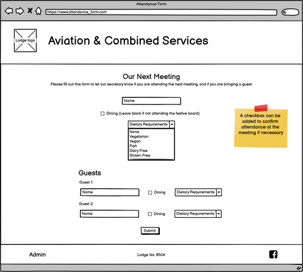
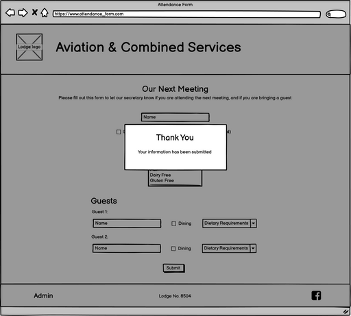
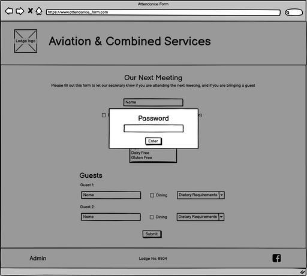
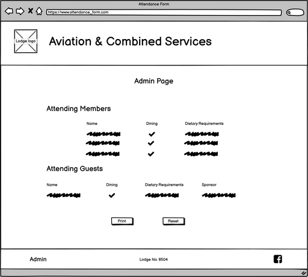
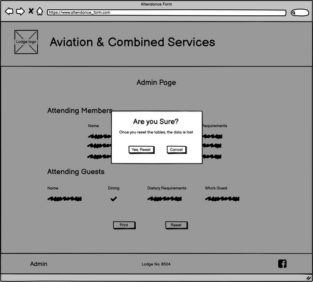
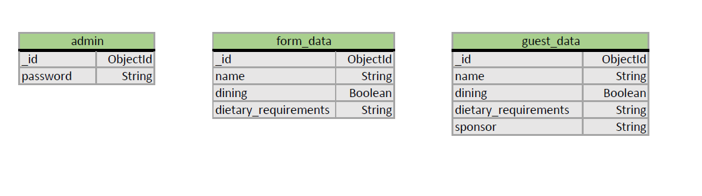

# Attendance Form

This is a page designed for a social group that want to know how many of their members will be attending a meeting, whether they wish to dine after the meeting, and whether they have any guests.

## Table of Contents
1. [UX](#ux)
    - [User Stories](#user-stories)
    - [Design](#design)
    - [Wireframes](#wireframes)
2. [Features](#features)
3. [Technologies Used](#technologies-used)
4. [Testing](#testing)
5. [Deployment](#deployment)
6. [Credits](#credits)
    - [Content](#content)
    - [Acknowledgements](#acknowledgements)

## UX

### User Stories
  - As a user, I want to:
    - have a clear picture of what the page is for
    - easily understand what information is required by the form
    - be notified if I have not filled the form in correctly
    - be notified that the form was submitted successfully
  - As the site administrator, I want to:
    - have a secure access to the admin page
    - have the data collected display in an easy-to-read way
    - have the ability to clear the data
    - be warned before that data is cleared

### Design
The main page is a simple form with a club logo and clean [Bootstrap](https://getbootstrap.com/docs/4.6/getting-started/introduction/) form layout. The admin page will be accessed through a link on the top of the page, and is password protected. The admin page will display the data gathered from the forms that have been submitted in a table, with totals displayed clearly when necessary.

### Wireframes
Below are the wireframes used to help design the page layouts

#### Home Page

#### Form Submission Modal

#### Login Modal

#### Admin Page

#### Reset Confirmation Modal

Back to [Table of Contents](#table-of-contents)
### Database
The database used is a non relational database, using [MongoDB](https://www.mongodb.com/), and containing one table with the required fields.Belo is the database schema used:
 

## Features
  - A central logo to identify the site owner with a heading and instructions for the user
  - A [Bootstrap](https://getbootstrap.com/docs/4.6/getting-started/introduction/) form to allow the user to easily input their information
  - An admin page to display the data
  - Controls on the admin page to allow the admin to update or delete the data

## Technologies Used
### Languages:
  - [HTML5](https://en.wikipedia.org/wiki/HTML5)
    - This is the main mark-up language for the project
  - [CSS3](https://en.wikipedia.org/wiki/CSS)
    - Used for personalised styling over and above the Bootstrap styles
  - [JavaScript](https://en.wikipedia.org/wiki/JavaScript)
    - Used to animate and control aspects of the pages that move
  - [Python](https://www.python.org/)
    - Used to connect the frontend application to the backend database, and to control the navigation and publication of the application
  - [Jinja](https://jinja.palletsprojects.com/en/3.0.x/)
    - A templating language/engine used to simplify the page layouts and insert data from the database

### Libraries and Frameworks:
  - [Google Fonts](https://fonts.google.com/)
    - Used as the source for the font databases used in this site
  - [Font Awesome 5.15.3](https://fontawesome.com/)
    - Used as the source for the icons used
  - [Bootstrap 4.6](https://getbootstrap.com/docs/4.6/getting-started/introduction/)
    - The main CSS library used to style the pages and make it responsive

### Tools:
  - [Atom](https://atom.io/) with [GitHub Desktop](https://desktop.github.com/)
    - Atom is my preferred text editor, linked with GitHub Desktop in order to push the code to GitHub
  - [Git](https://git-scm.com/)
    - Used for version control
  - [GitHub](https://github.com/)
    - Used to store the project files
  - [Balsamiq](https://balsamiq.com/)
    - A wireframe program used to create the mock-ups
  - [Coolors](https://coolors.co/)
    - An online tool to create colour palettes

Back to [Table of Contents](#table-of-contents)

## Testing

## Deployment
### Heroku
Deployment for this project is via [Heroku](https://www.heroku.com).
1. Create a requirements.txt file by typing pip3 freeze --local > requirements.txt in your repository terminal
2. Create a Procfile so that Heroku knows how to run the app. Do this by typing echo web: python app.py into your repositories terminal
3. Make sure these files have been pushed to the GitHub repository and then navigate to [Heroku](https://www.heroku.com)
4. Log in and select 'new' in the top right, name your app and choose a region that is closest to you. The app name must be unique.
5. On the dashboard for your app, select the 'Deploy' tab and under deployment method, select GitHub (the easiest option if your repository is in GitHub)
6. Enter the repository name underneath that and hit search. select the repository by clicking 'Connect'
7. You can either select Automatic or Manual deployment depending on your method. This project has been deployed with the manual method. Remember that if you choose manual, then every time the main/master branch is changed, you will need to re-deploy the app.
8. Next, go to the 'Settings' tab and select 'Reveal Config Vars'
9. Here you need to add several KEY: VALUE pairs for the app to run. They are
  - I.P: 0.0.0.0
  - PORT: 5000
  - MONGO_DBNAME: *database name*
  - MONGO_URI: *MongoDB URI, taken from the connections section of the database*
  - SECRET_KEY: *secret key of your choice*
10. Once these KEY: VALUE pairs have been added, the app will be reachable from the [Heroku](https://www.heroku.com) portal

### Forking the Repository
If you would like to view/change the code for the project then you can copy this repository to your GitHub account by forking it. You will then be able to do this without affecting the original repository:
1. From the repository home page,  click the 'fork' button (just below your picture with the dropdown menu)
2. You should now have a copy of the repository on your account

### Making a Local Clone
1. From the repository home page, select the 'code' tab (next to the green 'Gitpod' button)
2. To clone the repository using HTTPS, under "Clone with HTTPS", copy the link.
3. Open Git Bash
4. Change the current working directory to the location where you want the cloned directory to be made.
5. Type 'git clone', and then paste the URL you copied in Step 2.
6. Press Enter. Your local clone will be created.
7. Alternatively, you can use 'Open with GitHub Desktop' and follow the instructions, or just download the ZIP file containing the code files

Click [Here](https://docs.github.com/en/github/creating-cloning-and-archiving-repositories/cloning-a-repository-from-github/cloning-a-repository#cloning-a-repository-to-github-desktop) to view the GitHub documentation on deployment, or [Here](https://devcenter.heroku.com/)for the Heroku documentation for further help and advice.

Back to [Table of Contents](#table-of-contents)

## Credits

### Content
  - All content was written by myself or taken from documentation relating to the various API's used to facilitate this page.

Back to [Table of Contents](#table-of-contents)
